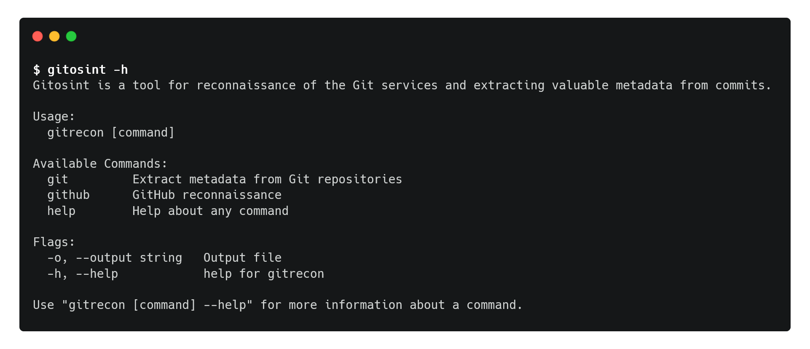
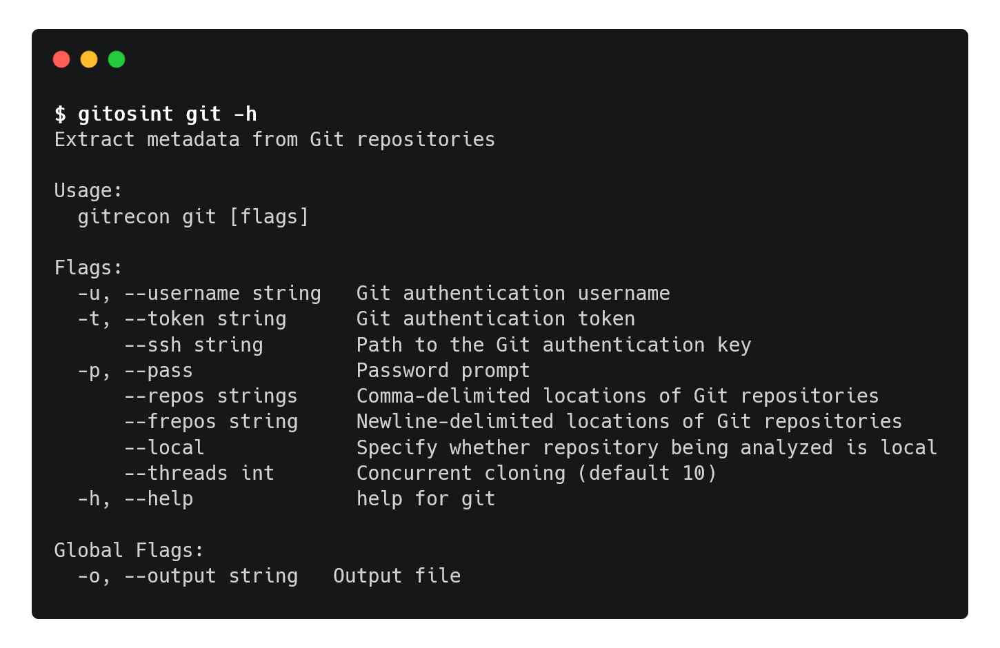
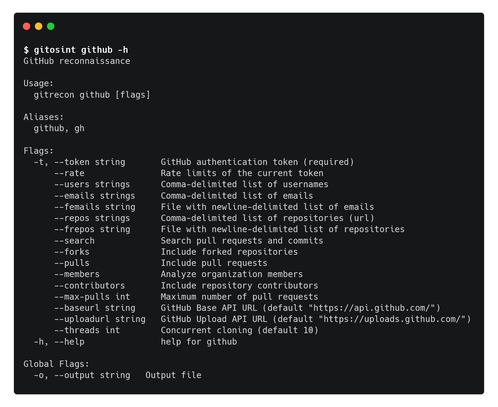

<h1 align="center">

</h1>
<h4 align="center">Gitosint is a tool for reconnaissance of the Git services and extracting valuable metadata from commits.</h4>

<p align="center">

</p>

## Features

* Extract commit metadata (emails and usernames) from Git repositories
* Analyze GitHub users and organizations
  * Extract commit metadata from repositories, pull requests and GitHub Search results

* Find GitHub users by email addresses
  * Tool is taking advantage of a GitHub [feature](https://docs.github.com/en/github/committing-changes-to-your-project/troubleshooting-commits/why-are-my-commits-linked-to-the-wrong-user#commits-are-linked-to-another-user), which uses the email address in the commit header to link the commit to a GitHub user . 

## Install Gitosint

The tool requires Go 1.16 version. Ensure that `GO111MODULE=on` is set.

```bash
$ git clone https://github.com/wavvs/gitosint
$ cd gitosint/
$ go install
```

## Usage

*Note*: The tool is in beta status. Output of the tool may significantly change in the future.



### Extracting commit metadata from Git repositories



Extract commit metadata from the remote repositories:

```
$ gitosint git --repos <url_1>,...,<url_N>
```

Authenticate to the remote repositories using Basic Auth:

```
$ gitosint git --frepos repos.txt -u <user> -t <token_or_pass> 
or
$ gitosint git --frepos repos.txt -u <user> -p
```

You can also use SSH keys and provide corresponding URLs:

```
$ gitosint git --repos <url_1>,...,<url_N> --ssh <path_to_key> -p
```

### GitHub reconnaissance



Before using this command you need to obtain an access token from **Settings** > **Developer settings** > **Personal access tokens**. Token should have following scopes:

- **repo**
  * repo:status
  * public_repo
- **admin:org**
  * read:org
- **user**
  * read:user
  * user:email
- **delete_repo**

Extract commit metadata from the repositories and the pull requests of the GitHub user (only non-merged pull requests will be analyzed): 

```
$ gitosint github -t <token> --users <user> --pulls --max-pulls 500
```

Extract commit metadata from the repositories and the results of GitHub Search (includes searching commits and pull requests):

```
$ gitosint github -t <token> --users <user> --search --pulls
```

You can also perform analysis of the GitHub organizations and their members:

```
$ gitosint github -t <token> --users <org> --pulls --members
```

Note: omit `--members` option if an organization has too many members. The tool will exhaust rate limits before finishing analysis of the members.

Find GitHub users by email addresses:

```
$ gitosint github -t <token> --emails <email_1>,...,<email_N> --search
```

Extract commit metadata from specific repositories and list their contributors (uses tool functionality):

```
$ gitosint github -t <token> --repos <github_repo_url> --contributors
```

Note: If you encounter "*push declined due to email privacy restrictions*" error temporarily disable "**Block command line pushes that expose my email**" option at **Settings** > **Emails**.

## TODO

* Add GitLab support
* Improve tool output
* Improve documentation
* Add logging
* Add option to pause the tool until rate limits are restored
